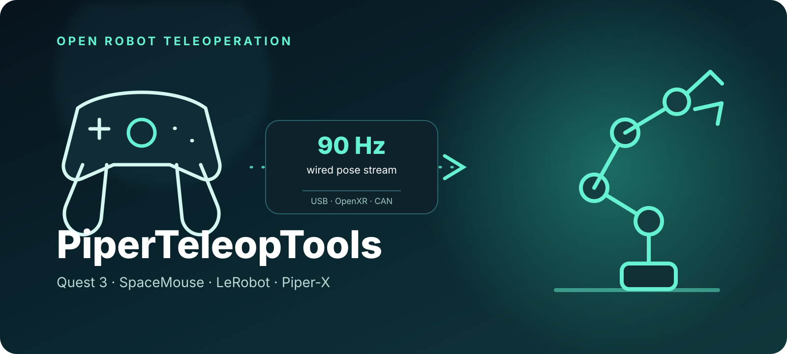
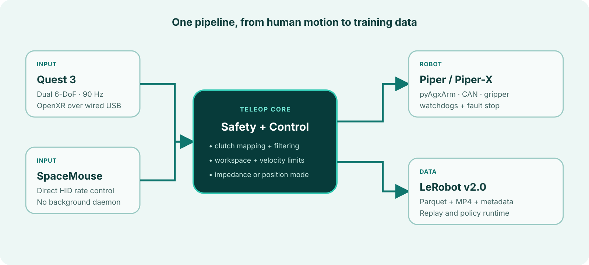

<p align="center">
  
</p>

<h1 align="center">PiperTeleopTools</h1>

<p align="center">
  <strong>Low-latency Quest 3 and SpaceMouse teleoperation, LeRobot data
  collection, replay, and policy deployment for Piper-X.</strong>
</p>

<p align="center">
  <a href="https://github.com/tomakeIT/PiperTeleopTools/actions/workflows/ci.yml"></a>
  
  
  
  
</p>

Teleoperate an AgileX Piper / Piper-X (6 DOF + gripper) with a Meta Quest 3
controller or a 3Dconnexion SpaceMouse, record demonstrations directly as
**LeRobot v2.0 datasets** (with GR00T-style modality metadata), and close the
loop with episode replay and a policy-inference runtime.

> [!CAUTION]
> This is experimental robotics software, not a safety-rated control system.
> Software clamps and watchdogs reduce risk but are not certified force or
> motion limits. Keep the manufacturer's emergency stop accessible, clear the
> workspace, verify configuration in simulation, and supervise every real-arm
> run.

📖 **[Full documentation](https://jialengni.com/PiperTeleopTools/)**
(MkDocs + Material, from a zero-hardware
quick start to wire protocols). Every push to `main` automatically builds and
publishes the documentation with GitHub Pages.

## Features

- 🥽 **Native Quest 3 app** (C++ / OpenXR, no Unity): 90 Hz dual-controller
  poses over a wired USB link (`adb forward`), color passthrough, up to three
  floating camera panels plus a recording HUD inside the headset, haptic
  feedback;
- 🖱️ **SpaceMouse rate control**: direct HID read (no spacenavd), switchable
  with one flag;
- 🫳 **Two control modes**: MIT impedance control (default — compliant on
  contact, bounded force, host-side DLS-IK + torque-snapshot gravity
  feed-forward) / firmware position control (1.3 mm RMS tracking);
- 📦 **Direct LeRobot v2.0 writing**: parquet + mp4 (PTS timestamp-aligned) +
  full metadata, including a per-session provenance record of the controller,
  firmware, and gains, with a change guard on binding-critical parameters;
- 🖥️ **Web dashboard while collecting**: recording state, episode timer,
  saved count, and live camera thumbnails at `http://127.0.0.1:8780` —
  read-only, zero extra dependencies;
- 🔁 **Replay & inference runtime**: open-loop episode replay (with a
  reproduction-error report), an observation→policy→action-chunk execution
  loop, and a framework-agnostic HTTP policy-server protocol;
- 🛡️ **Safety envelope**: workspace box, velocity/step clamps,
  target-to-measured deviation tethering (caps contact force), stream
  watchdogs, fault-triggered stops, and automatic position-hold handback on
  exit;
- ✅ 61 unit/integration tests; the full chain verified on real hardware.

## Architecture



## Hardware requirements

| Component | Notes |
|---|---|
| AgileX Piper / Piper-X | 6 DOF + AgxGripper, USB-CAN (gs_usb/candleLight) @ 1 Mbps |
| Meta Quest 3 *(optional)* | Developer mode + USB data cable; or use a SpaceMouse |
| 3Dconnexion SpaceMouse *(optional)* | Compact/Wireless etc., USB |
| Intel RealSense *(optional)* | e.g. D435i, 1–3 cameras for visual observations |
| Host | Linux (Ubuntu 22.04 verified), conda; building the APK needs a ~2.5 GB Android toolchain |

## Command cheat sheet

Install (fresh machine, in order):

| Command | Purpose |
|---|---|
| `make toolchain` | Android SDK/NDK/JDK17/Gradle (only needed to build the APK) |
| `make env` | conda env `piper_teleop` + deps + pyAgxArm |
| `make can` | can0 @ 1 Mbps (sudo) |
| `make apk` | build the Quest APK |
| `bash install/05_quest_udev.sh` | Quest USB debugging permissions (sudo, one-time) |
| `make spacemouse` | SpaceMouse udev rules + read test (sudo, one-time) |

Daily:

| Command | Purpose |
|---|---|
| `make connect` | after plugging in the Quest: install/start APK + `adb forward` + proximity sensor off |
| `make home` | after every arm power-on: unfold from the folded pose to the working pose |
| `make view` | rerun visualization of controller poses |
| `make collect TASK="..."` | THE app: teleop + recording — recording starts only when you press A/space, nothing is saved until you do. Uses `default.yaml`; add an overlay with `CONFIG=first_run.yaml`; variants: `collect-sm` (SpaceMouse) / `collect-sim` (no hardware) |
| `piper-replay --root <ds>` | replay a recorded episode + reproduction-error report |
| `piper-infer --policy <spec>` | policy-inference execution loop |
| `piper-track-test [--position]` | tracking-error benchmark |
| `piper-finalize --root <ds>` | generate relative/delta stats |
| `make test` | unit tests |

After `make env`, activate the environment with
`conda activate piper_teleop`. For a standard editable install without the
bootstrap script, use `python -m pip install -e ".[full]"`; real-arm control
still requires the separate pyAgxArm SDK described in the installation guide.

For the first real-arm session add the conservative overlay:
`make collect CONFIG=first_run.yaml` (50% speed, 0.6 position scale).

## Control modes

| | `piper_mit` (default) | `piper` (`--position`) |
|---|---|---|
| Principle | host DLS-IK → per-joint MIT impedance (T = kp·Δq − kd·v + t_ff) + torque-snapshot gravity feed-forward | streamed `move_p` poses, IK in firmware |
| Contact behavior | **compliant**; contact force capped ≈ kp × deviation clamp (~20 N default) | rigid (position servo) |
| Measured tracking | ~14 mm RMS / 90 ms (soft gains; higher kp = tighter) | **1.3 mm RMS / 10 ms** |
| Best for | day-to-day collection, contact tasks, safe RL exploration | high-precision free-space tasks |

Impedance mode ships with: torque-continuous mode handover (gain soft-start +
unramped gravity snapshot), automatic intersection with the SDK per-model
joint limits, hold-on-IK-divergence, and position-hold handback on exit.
Tuning: droops under gravity → raise kp; hums / hard to push → lower kp, kd.

## Controls

**Quest** (default right hand, configurable via `quest.control_hand`):

| Input | Function |
|---|---|
| hold **grip** | clutch engage: controller deltas map 1:1 to the EEF (release freezes; re-grip to ratchet) |
| **trigger** (analog) | gripper open/close (continuous) |
| **A / X** | start / stop-and-save episode (haptic confirm, view tints red) |
| **B / Y** | discard current episode |
| non-control hand **Y/B** held 1 s | home to the working pose |
| non-control hand **X/A** held 1 s | discard current episode, or delete the last episode saved this session |
| left **menu** | force clutch release |
| long-press **Meta** | re-place the floating panels in front of you |

**SpaceMouse**: puck = EEF velocity (stops on release); left button = gripper
toggle; right button short press = start/stop recording, hold 1 s = home;
both buttons = discard. Flip axes that feel backwards via
`spacemouse.axis_signs`.

## Dataset format (LeRobot v2.0)

```
<root>/
├── meta/{info.json, modality.json, episodes.jsonl, tasks.jsonl, stats.json,
│         collection_meta.json, collection_sessions.jsonl}   # provenance
├── data/chunk-000/episode_000000.parquet     # 30 Hz
├── videos/chunk-000/observation.images.<cam>/episode_000000.mp4  # 30 fps
└── extras/                                   # raw input streams (debug)
```

| parquet column | dim | contents |
|---|---|---|
| `observation.arm_joint` | 6 | measured joint angles (rad) |
| `observation.arm_eef` | 7 | measured flange pose: pos (3) + **quat wxyz** (4), base frame |
| `observation.gripper` | 1 | measured gripper width (m) |
| `action.arm_eef` | 7 | **absolute** EEF target |
| `action.gripper` | 1 | target gripper width (m) |

Conventions: meters/radians, absolute actions, video PTS shares the parquet
`timestamp` clock (timestamp-based alignment, naturally tolerant of rate
mismatch). Trainer-side, set `action_frequency=30` and downsample with stride
3 for a 10 Hz decision rate. Session provenance goes to
`collection_meta.json` (controller, firmware, gains, camera serials, …);
changing binding-critical parameters between sessions triggers a prominent
warning — **a policy is bound to the controller parameters it was trained
under**.

## Replay & inference

```bash
piper-replay --root <ds> [--episode 0] [--speed 0.7] [--position]
piper-infer --policy replay:<ds>:0            # closed-loop self-test
piper-infer --policy http://gpu-host:8901     # remote model server
```

Inference loop: every 0.5 s rebuild the observation (latest camera frames +
joints/EEF/gripper) → `predict()` returns a 30-step absolute action chunk →
execute at 30 Hz, under the same safety envelope as teleoperation. The HTTP
protocol (`POST /predict`, JSON + base64 JPEG → `(H, 8)` action chunk) is
documented in `piper_teleop/policy.py`; a reference server ships as
`python -m piper_teleop.tools.example_policy_server`.

## Measured benchmarks (Piper-X, firmware S-V1.8-9)

| Metric | Position mode | Impedance mode (soft gains) |
|---|---|---|
| Static hold error | ≈0 mm | 11 mm |
| Dynamic RMS (3 cm circle, 5 s/lap) | 1.34 mm | 14.1 mm |
| Estimated latency | ~10 ms | ~90 ms |

Measured Quest pose link: 90–92 Hz; the video panels never affect the pose
stream (separate port + drop-frames-never-queue).

## Troubleshooting

| Symptom | Fix |
|---|---|
| `adb devices` empty / `unauthorized` | `install/05_quest_udev.sh`; allow USB debugging in the headset |
| APK runs but no data | `make connect` (wake + proximity off); `adb logcat -s QuestTeleop` |
| Controllers valid but tracked=false | aim the headset at the operating area (controllers are camera-tracked) |
| `enable arm` timeout | arm powered? `ip -details link show can0` must show 1 Mbps |
| `TARGET_POS_EXCEEDS_LIMIT(4)` | arm is in the folded pose: run `make home` first |
| Humming in impedance mode | lower `impedance.kp/kd` (see Control modes) |
| SpaceMouse won't open | `make spacemouse` for udev rules, replug; stop spacenavd |
| pytest errors from external plugins | use `make test` (isolated PYTHONPATH and plugins) |

See the [full documentation](docs/) for detailed, symptom-first
troubleshooting.

## Acknowledgements & dependencies

[pyAgxArm](https://github.com/agilexrobotics/pyAgxArm) (official AgileX SDK,
LGPL-3.0) · [LeRobot](https://github.com/huggingface/lerobot) dataset format ·
[rerun](https://rerun.io) · [stb_image](https://github.com/nothings/stb)
(public domain, vendored) · Khronos OpenXR loader.

## License

[MIT](LICENSE). Note that pyAgxArm is an LGPL-3.0 runtime dependency
(installed via pip; not vendored).

See [CONTRIBUTING.md](CONTRIBUTING.md) for development setup and
[SECURITY.md](SECURITY.md) for responsible vulnerability reporting.
