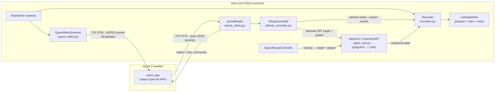

# Architecture & protocols

This page is the technical map of PiperPilot: which processes and threads
exist, how the Quest headset talks to the host over USB, the exact wire
protocols on both TCP ports, the rates every loop runs at, and where each layer
of the safety envelope lives. If you just want to drive the arm, start with the
[Quest guide](../guide/quest.md) instead — come back here when you need to
debug, extend, or reason about the system.

## System overview

One host process runs everything: it reads controller poses from the headset
(or a SpaceMouse), turns them into absolute end-effector targets, streams those
to the arm over CAN, and — during collection — samples synchronized
state/action/camera rows into a LeRobot dataset.



Both TCP connections travel over the USB cable: `make connect`
(scripts/quest_connect.sh) runs `adb forward` so that the host connects to
`127.0.0.1:8735` and `127.0.0.1:8736` and adb tunnels the bytes into the app on
the headset. The host is the TCP client on both sockets.

The SpaceMouse path replaces the Quest input stage only: `SpaceMouseController`
reads the puck directly over HID (no spacenavd daemon) and produces the same
kind of absolute targets for the same arm backends, so recording and safety
behave identically. See the [SpaceMouse guide](../guide/spacemouse.md).

The arm backends (`piper_mit` MIT impedance — the default — vs `piper`
firmware position control, plus the host-side DLS-IK used in impedance mode)
are documented in [Control modes](control-modes.md). What the writer produces
is documented in [Dataset format](dataset-format.md).

## Why wired USB, and why two sockets

Three transport decisions shape the design:

1. **Wired USB via `adb forward`, not Wi-Fi.** The pose link is the control
   input of a physical robot; a wired link keeps it stable and low-latency.
   The measured pose rate over this link is 90–92 Hz (see
   [Benchmarks](benchmarks.md)).
2. **The pose stream has absolute priority.** Port 8735 carries only small
   newline-delimited JSON messages on its own socket with `TCP_NODELAY`.
   Nothing else shares that connection.
3. **Video is a separate socket that drops frames instead of queueing.**
   The panel stream on port 8736 uses a non-blocking socket with a small
   send buffer (256 KiB), so back-pressure surfaces immediately and the
   sender drops the frame rather than building a latency queue. Congestion
   can only reduce the video frame rate — it can never add latency to the
   pose or control path.

!!! note
    `QuestReader` keeps only the latest state (no queue) and auto-reconnects
    with a 1 s backoff, so a dropped link never blocks the control loop — it
    trips the stale watchdog instead (see below).

## Pose protocol (port 8735)

Newline-delimited JSON in both directions. The host parses each line and
dispatches on the keys present.

### Headset → host messages

| Message | Recognized by | Effect on the host |
|---|---|---|
| Hello | top-level key `"hello"` | Payload stored; exposed as `QuestReader.hello` |
| Heartbeat | top-level key `"heartbeat"` | Updates the session state from the `"state"` field |
| Pose frame | top-level key `"head"` | Replaces the latest `QuestState`; timestamps the receipt |

A pose frame carries these top-level fields (defaults shown are what the host
assumes when a field is missing):

| Field | Type | Meaning |
|---|---|---|
| `t` | float | Headset predicted display time, seconds |
| `mono` | float | Headset `CLOCK_MONOTONIC`, seconds |
| `frame` | int | Frame counter |
| `state` | string | XR session state (default `"UNKNOWN"`) |
| `space` | string | XR reference space (default `"stage"`) |
| `head`, `left`, `right` | object | One pose object each (see below) |

Each of `head` / `left` / `right` is an object with:

| Field | Type | Meaning |
|---|---|---|
| `pos` | `[x, y, z]` | Position in the XR reference space |
| `quat` | `[x, y, z, w]` | Orientation quaternion, **xyzw** order |
| `valid` | bool | Pose is valid |
| `tracked` | bool | Actively tracked (not just extrapolated) |
| `trigger` | float | Analog trigger, 0–1 (drives the gripper) |
| `squeeze` | float | Analog grip, 0–1 (drives the clutch) |
| `stick` | `[x, y]` | Thumbstick deflection |
| `stick_click` | bool | Thumbstick pressed |
| `primary` | bool | **X** (left) / **A** (right) |
| `secondary` | bool | **Y** (left) / **B** (right) |
| `menu` | bool | Menu button |

!!! warning "Quaternion order differs from the dataset"
    The wire protocol uses **xyzw**; recorded datasets store **wxyz** (see
    [Dataset format](dataset-format.md)). The conversion happens on the host.

### Host → headset commands

The host writes single-line JSON commands back on the same socket:

```json
{"cmd": "haptic", "hand": "both", "amp": 0.6, "ms": 120}
```

```json
{"cmd": "color", "r": 0.6, "g": 0.02, "b": 0.02, "a": 0.25}
```

| Command | Fields | Purpose |
|---|---|---|
| `haptic` | `hand` (`"left"`/`"right"`/`"both"`), `amp`, `ms` | Controller vibration — used for episode start/save/discard and homing confirmations |
| `color` | `r`, `g`, `b`, `a` | Background tint over passthrough; `a` is the tint opacity (0 = invisible). The recorder sets a red tint while recording and clears it when idle |

Panel re-placement is done in-headset (long-press the **Meta** button), not by
a host command.

## Video protocol (port 8736)

`QuestVideoStreamer` sends JPEG frames on a dedicated connection with a fixed
binary framing, little-endian:

```
[u32 magic 'PCV1' (0x31564350)] [u8 cam] [3 pad bytes] [u32 len] [len bytes of JPEG]
```

- `cam` 0–2 select the up-to-three floating camera panels; `cam` 3 is the
  status HUD panel.
- Camera panels default to 15 fps, JPEG quality 70, resized to at most 640 px
  wide (`quest.video.*` config keys — see
  [Configuration](configuration.md)). The camera name is burned into a banner
  at the top of each frame, so the headset needs no text rendering.
- The status HUD (recording state, episode timer, input rate, last error) is
  sent as panel 3 at roughly 5 Hz.
- Sends are all-or-nothing: a frame that would block is dropped and counted;
  a partially-sent frame is completed with short bounded blocking sends so the
  stream never desyncs. A dead link triggers a reconnect with a 1 s backoff.

## Threads and rates

Every stage runs on its own daemon thread inside the one host process, each
with an independent rate and an independent failure response. A slow or dead
stage degrades only itself — never the control path.

| Loop (thread name) | Rate | Config key | When it stalls or falls behind |
|---|---|---|---|
| Pose stream (`quest-reader`) | 90 Hz from the headset (measured 90–92) | — | If no frame arrives within `quest.stale_timeout_s` (default 0.25 s), the controller disengages the clutch and stops streaming targets; the reported input rate drops to 0 after 1 s of silence |
| Control loop (`teleop-ctl`) | 100 Hz | `teleop.rate_hz` | Exceptions are caught per tick so one bad tick never kills the loop; if the loop falls behind schedule it resyncs instead of bursting |
| Gripper commands | 50 Hz | `gripper.rate_hz` | The controller calls the gripper every tick; the arm backend throttles to this rate and silently skips the excess |
| Recorder (`recorder`) | 30 Hz | `recording.fps` | Exceptions (disk full, encoder error, …) are caught and surfaced as a status message; duplicate camera frames are skipped by frame id |
| Panel streaming (`quest-video`) | 15 fps + HUD ~5 Hz | `quest.video.fps` | Frames are dropped on back-pressure; a dead link reconnects with a 1 s backoff |
| SpaceMouse input | 100 Hz | `spacemouse.rate_hz` | No HID report within `spacemouse.stale_timeout_s` (default 0.15 s) → the commanded twist is treated as zero, so the arm stops |

The recorder's 30 Hz matches the 30 fps cameras so every proprio/action row
has a near-simultaneous fresh frame; all streams share one monotonic clock and
are aligned by timestamp (video PTS in ms).

## The safety envelope

Safety is layered: each layer catches a different failure, and each lives in a
specific place. From the input inward:

1. **Input filtering** — the raw controller pose passes through a one-euro
   filter before it is mapped to the robot, suppressing tracking jitter.
   Lives in `TeleopController`.
2. **Engage preconditions** — the clutch refuses to engage if there is no EEF
   feedback, if the arm reports a fault status, or if the EEF sits outside the
   workspace box (the folded factory pose is outside it — hence
   "run `make home` first"). Lives in `TeleopController`.
3. **Workspace box** — the target position is clipped to
   `teleop.limits.workspace_min/max`, default
   `[0.15, −0.35, 0.03]` … `[0.55, 0.35, 0.50]` m in the base frame. Lives in
   `TeleopController`, applied every tick.
4. **Per-tick step clamps** — target displacement per tick is capped at
   `max_lin_vel` (default 0.8 m/s) and `max_ang_vel` (default 2.5 rad/s)
   divided by the loop rate, relative to the previous command. A pitch guard
   additionally clamps pitch to ±88° because the firmware's `move_p` rejects
   |pitch| > 90°. Lives in `TeleopController`.
5. **Target tether (deviation guard)** — the commanded position is never
   allowed more than `max_cmd_deviation` (default 0.12 m) from the *measured*
   EEF position. This prevents a catch-up lunge when the target ran ahead of
   the arm (dragged against a workspace edge, blocked by contact), and in
   impedance mode it is what bounds the contact force — see
   [Control modes](control-modes.md). Lives in `TeleopController`.
6. **Stale-stream watchdogs** — a pose stream older than 0.25 s disengages the
   clutch and freezes the target (the firmware holds the last commanded pose);
   a SpaceMouse silent for 0.15 s commands zero velocity. Live in
   `TeleopController` and the SpaceMouse path respectively.
7. **Arm-fault stop** — any non-normal arm status disengages immediately and
   stops streaming targets; re-engaging is refused until the fault clears.
   Lives in `TeleopController`, checked every engaged tick.
8. **Exit handback** — on shutdown the impedance backend hands the arm back to
   firmware position hold at its current joints, so the process never exits
   leaving the arm in torque mode. Lives in the arm backend
   (see [Control modes](control-modes.md)).

After any disengage, the latched command is invalidated: the next clutch
engage latches onto the arm's actively-held target (or, failing that, the
measured pose) rather than snapping back to a stale one. While no command
exists, the recorder mirrors the measured state so recorded actions stay
absolute and well-defined.

## Where to go next

- [Control modes](control-modes.md) — `piper_mit` vs `piper` backends,
  host-side DLS-IK, gains, and the impedance entry/exit sequence.
- [Configuration](configuration.md) — every key referenced above.
- [Dataset format](dataset-format.md) — what the recorder and
  `LeRobotWriter` produce.
- [Benchmarks](benchmarks.md) — measured tracking error and latency per mode.
